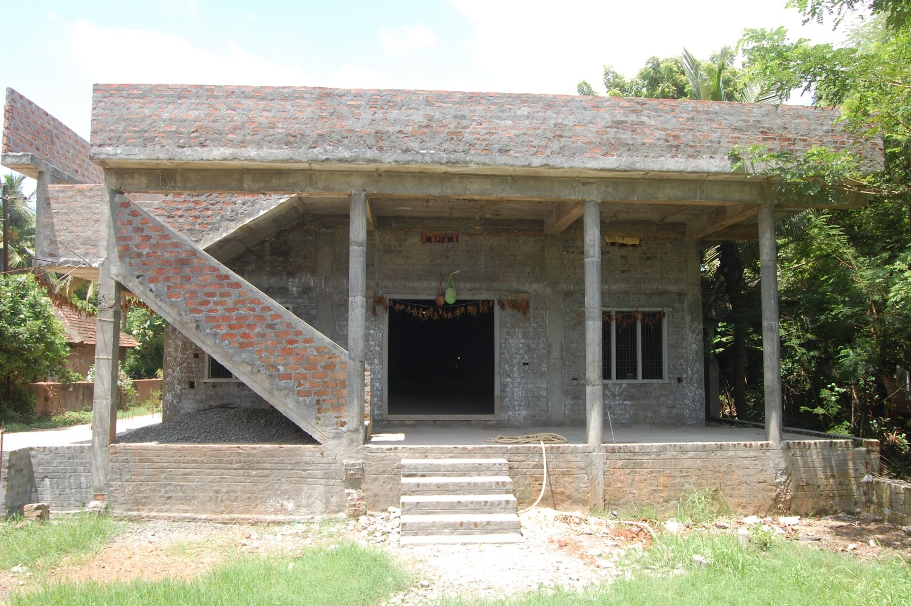
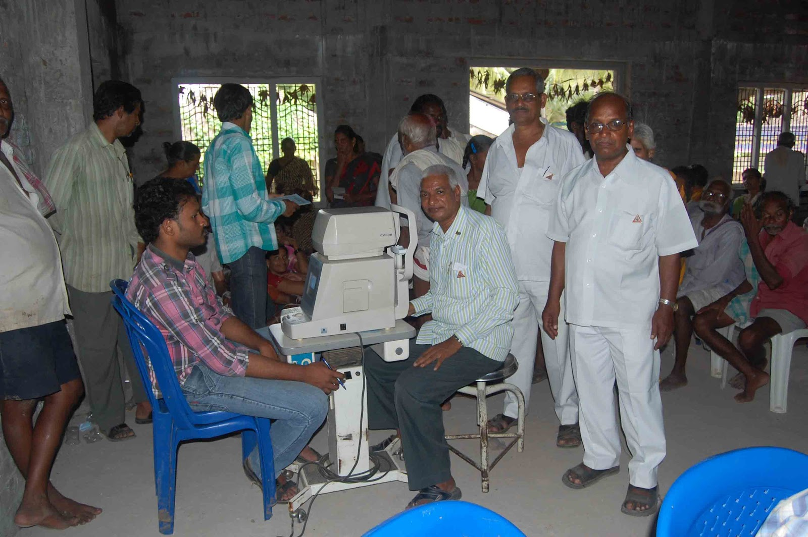

# Trust
<!DOCTYPE html>
<html dir="ltr" lang="en">

<head>

    <!-- Meta Tags -->
    <meta name="viewport" content="width=device-width,initial-scale=1.0" />
    <meta http-equiv="content-type" content="text/html; charset=UTF-8" />
    <meta name="description" content="Charityfaith - Nonprofit, Crowdfunding, Education & Charity HTML5 Template" />
    <meta name="keywords" content="charity, funding,building,business,construction,cleaning,transport,workshop" />
    <meta name="author" content="ThemeMascot" />

    <!-- Page Title -->
    <title>Pulavarti Educational Trust</title>

    <!-- Favicon and Touch Icons -->
    <link href="images/favicon.png" rel="shortcut icon" type="image/png">
    <link href="images/apple-touch-icon.png" rel="icon">
    <link href="images/apple-touch-icon-72x72.png" rel="icon" sizes="72x72">
    <link href="images/apple-touch-icon-114x114.png" rel="icon" sizes="114x114">
    <link href="images/apple-touch-icon-144x144.png" rel="icon" sizes="144x144">

    <!-- Stylesheet -->
    <link href="css/bootstrap.min.css" rel="stylesheet" type="text/css">
    <link href="css/jquery-ui.min.css" rel="stylesheet" type="text/css">
    <link href="css/animate.css" rel="stylesheet" type="text/css">
    <link href="css/css-plugin-collections.css" rel="stylesheet" />
    <!-- CSS | menuzord megamenu skins -->
    <link id="menuzord-menu-skins" href="css/menuzord-skins/menuzord-boxed.css" rel="stylesheet" />
    <!-- CSS | Main style file -->
    <link href="css/style-main.css" rel="stylesheet" type="text/css">
    <!-- CSS | Preloader Styles -->
    <link href="css/preloader.css" rel="stylesheet" type="text/css">
    <!-- CSS | Custom Margin Padding Collection -->
    <link href="css/custom-bootstrap-margin-padding.css" rel="stylesheet" type="text/css">
    <!-- CSS | Responsive media queries -->
    <link href="css/responsive.css" rel="stylesheet" type="text/css">
    <!-- CSS | Style css. This is the file where you can place your own custom css code. Just uncomment it and use it. -->
    <!-- <link href="css/style.css" rel="stylesheet" type="text/css"> -->

    <!-- CSS | Theme Color -->
    <link href="css/colors/theme-skin-orange.css" rel="stylesheet" type="text/css">

    <!-- external javascripts -->
    
    
    
    <!-- JS | jquery plugin collection for this theme -->
    

    <!-- HTML5 shim and Respond.js for IE8 support of HTML5 elements and media queries -->
    <!-- WARNING: Respond.js doesn't work if you view the page via file:// -->
    <!--[if lt IE 9]>
  
  
<![endif]-->
</head>

<body class="">
    

        <!-- preloader -->
        

            

                

                    
<i></i><i></i><i></i><i></i>

                

            

            
Disable Preloader

        

        <!-- Header -->
        <header id="header" class="header">
            

                

                    

                        

                            

                                <ul class="list-inline xs-text-center text-white mt-5">
                                    <li class="m-0 pl-10 pr-10"> <a href="#" class="text-white"><i
                                                class="fa fa-phone text-theme-colored"></i> 123-456-789</a> </li>
                                    <li class="m-0 pl-10 pr-10">
                                        <a href="#" class="text-white"><i
                                                class="fa fa-envelope-o text-theme-colored"></i>
                                            contact@yourdomain.com</a>
                                    </li>
                                </ul>
                            

                        

                        

                            

                                <ul
                                    class="styled-icons icon-dark icon-flat icon-sm pull-right flip sm-pull-none sm-text-center mt-sm-15">
                                    <li><a href="#"><i class="fa fa-facebook text-white"></i></a></li>
                                    <li><a href="#"><i class="fa fa-twitter text-white"></i></a></li>
                                    <li><a href="#"><i class="fa fa-google-plus text-white"></i></a></li>
                                    <li><a href="#"><i class="fa fa-instagram text-white"></i></a></li>
                                    <li><a href="#"><i class="fa fa-linkedin text-white"></i></a></li>
                                </ul>
                            

                        

                        

                            <a class="btn btn-colored btn-flat btn-theme-colored pb-10 ajaxload-popup"
                                href="ajax-load/reservation-form.html"><i class="fa fa-heart-o"></i> Appointment</a>
                            <a class="btn btn-colored btn-flat btn-theme-colored pb-10 ajaxload-popup"
                                href="ajax-load/volunteer-apply-form.html"><i class="fa fa-heart-o"></i> Join Us</a>
                        

                    

                

            

            

                

                    

                        <nav id="menuzord-right" class="menuzord default">
                            <ul class="menuzord-menu">
                                <li class="active"><a href="#home">Home</a>
                                    <ul class="dropdown">
                                        <li><a href="home-layout-1.html">Layout1</a></li>
                                        <li><a href="home-layout-2.html">Layout2</a></li>
                                    </ul>
                                </li>
                                <li><a href="home-about.html">About</a>
                                    <ul class="dropdown">
                                        <li><a href="home-fachievements.html">Founder Achievements</a></li>
                                        <li><a href="home-collabrations.html">Collabrations</a></li>
                                        <li><a href="home-currentyear.html">Current Year Students</a></li>
                                        <li><a href="home-achievements.html">Students Achievements</a></li>
                                        <li><a href="home-financials.html">Financials</a></li>
                                        <li><a href="home-donars.html">Donors</a></li>
                                    </ul>
                                </li>
                                <li><a href="home-contact1.html">Contact</a></li>
                                <li><a href="home-gallery.html">Gallery</a></li>
                                <li><a href="home-services.html">Services</a>
                                    <ul class="dropdown">
                                        <li><a href="home-educational.html">Educational Stats</a></li>
                                        <li><a href="home-philanthropic.html">Philanthropic Stats</a></li>
                                        <li><a href="home-community.html">Community Welfare Stats</a></li>
                                    </ul>
                                </li>
                                <li><a href="home-events.html">Events</a></li>
                            </ul>
                        </nav>
                    

                

            

        </header>

        <!-- Start main-content -->
        

            <!-- Section: inner-header -->
            <section class="inner-header divider parallax layer-overlay overlay-white-8"
                data-bg-img="http://placehold.it/1920x1280">
                

                    <!-- Section Content -->
                    

                        

                            

                                <h2 class="title">About</h2>
                                <ol class="breadcrumb text-center text-black mt-10">
                                    <li><a href="#">Home</a></li>
                                    <li class="active text-theme-colored">About</li>
                                </ol>
                            

                        

                    

                

            </section>

            <!-- Section: About  -->
            <section>
                

                    

                        

                            

                                <h2 class="mt-0 line-height-1 line-bottom">Welcome to  Pulavarti Educational Trust</h2>
                                

                                    

                                        

                                            
                                        

                                        

                                            <h4 class="mt-20 font-droid font-weight-700"><a href="#">Founder</a>
                                            </h4>
                                            
Sri Pulavarti Gopala Krishna Murty is the founder of the trust, which was
                                                established to ensure that selected poor and meritorious students do not
                                                suffer from financial barriers to their education. This was the dream of
                                                the late Pulavarti Suryakantham, his mother, who was dedicated to
                                                serving the underprivileged members of society, especially poor
                                                students. As the founder, he sets the agenda each year and coordinates
                                                with students and other members to ensure the successful completion of
                                                the trust’s objectives. It is important to note that new students are
                                                accepted into the trust based on its financial status. Through these
                                                efforts, the dream of Pulavarti Suryakantham is being fulfilled.

                                            <a class="btn btn-colored btn-sm btn-theme-colored mt-10"
                                                href="home-fachievements.html">Read more</a>
                                        

                                    

                                    

                                        

                                            
                                        

                                        

                                            <h4 class="mt-20 font-droid font-weight-700"><a href="#">Our History</a>
                                            </h4>
                                            
I was unable to pursue higher education due to the financial hardships I
                                                faced from childhood. My mother, the late Pulavarti Suryakantham,
                                                frequently spoke about the importance of helping students who are
                                                deprived of education and struggle financially. Inspired by her vision,
                                                I founded this trust in 2008 with an initial amount of 10,000 Rs,
                                                starting with just two students. Over the years, and with the grace of
                                                God, the trust has grown significantly. Today, we proudly support around
                                                20 students annually, spending an average of 200,000 Rs each year to
                                                assist them in their educational journey.ational journey.

                                            <a class="btn btn-colored btn-sm btn-theme-colored mt-10"
                                                href="home-fachievements.html">Read more</a>
                                        

                                    

                                

                            

                            

                                <h2 class="mt-0 line-height-1 line-bottom">Get Event</h2>
                                

                                    

                                        

                                            <ul>
                                                <li class="font-26 text-white font-weight-600">28</li>
                                                <li class="font-20 text-uppercase text-white">Feb</li>
                                            </ul>
                                        

                                        

                                            

                                                <h4
                                                    class="event-title media-heading font-raleway font-weight-700 mb-0 pt-5">
                                                    <a href="#">Gear up for giving</a>
                                                </h4>
                                                <i
                                                        class="fa fa-clock-o mr-5 text-theme-colored"></i> at 5.00 pm -
                                                    7.30 pm
                                                <i
                                                        class="fa fa-map-marker mr-5 text-theme-colored"></i> 25 Newyork
                                                    City
                                                
Lorem ipsum dolor sit amet

                                            

                                            
                                        

                                    

                                    

                                        

                                            <ul>
                                                <li class="font-26 text-white font-weight-600">28</li>
                                                <li class="font-20 text-uppercase text-white">Feb</li>
                                            </ul>
                                        

                                        

                                            

                                                <h4
                                                    class="event-title media-heading font-raleway font-weight-700 mb-0 pt-5">
                                                    <a href="#">Gear up for giving</a>
                                                </h4>
                                                <i
                                                        class="fa fa-clock-o mr-5 text-theme-colored"></i> at 5.00 pm -
                                                    7.30 pm
                                                <i
                                                        class="fa fa-map-marker mr-5 text-theme-colored"></i> 25 Newyork
                                                    City
                                                
Lorem ipsum dolor sit amet

                                            

                                            
                                        

                                    

                                    

                                        

                                            <ul>
                                                <li class="font-26 text-white font-weight-600">28</li>
                                                <li class="font-20 text-uppercase text-white">Feb</li>
                                            </ul>
                                        

                                        

                                            

                                                <h4
                                                    class="event-title media-heading font-raleway font-weight-700 mb-0 pt-5">
                                                    <a href="#">Gear up for giving</a>
                                                </h4>
                                                <i
                                                        class="fa fa-clock-o mr-5 text-theme-colored"></i> at 5.00 pm -
                                                    7.30 pm
                                                <i
                                                        class="fa fa-map-marker mr-5 text-theme-colored"></i> 25 Newyork
                                                    City
                                                
Lorem ipsum dolor sit amet

                                            

                                            
                                        

                                    

                                    

                                        

                                            <ul>
                                                <li class="font-26 text-white font-weight-600">28</li>
                                                <li class="font-20 text-uppercase text-white">Feb</li>
                                            </ul>
                                        

                                        

                                            

                                                <h4
                                                    class="event-title media-heading font-raleway font-weight-700 mb-0 pt-5">
                                                    <a href="#">Gear up for giving</a>
                                                </h4>
                                                <i
                                                        class="fa fa-clock-o mr-5 text-theme-colored"></i> at 5.00 pm -
                                                    7.30 pm
                                                <i
                                                        class="fa fa-map-marker mr-5 text-theme-colored"></i> 25 Newyork
                                                    City
                                                
Lorem ipsum dolor sit amet

                                            

                                            
                                        

                                    

                                    

                                        

                                            <ul>
                                                <li class="font-26 text-white font-weight-600">28</li>
                                                <li class="font-20 text-uppercase text-white">Feb</li>
                                            </ul>
                                        

                                        

                                            

                                                <h4
                                                    class="event-title media-heading font-raleway font-weight-700 mb-0 pt-5">
                                                    <a href="#">Gear up for giving</a>
                                                </h4>
                                                <i
                                                        class="fa fa-clock-o mr-5 text-theme-colored"></i> at 5.00 pm -
                                                    7.30 pm
                                                <i
                                                        class="fa fa-map-marker mr-5 text-theme-colored"></i> 25 Newyork
                                                    City
                                                
Lorem ipsum dolor sit amet

                                            

                                            
                                        

                                    

                                

                            

                        

                    

                

            </section>

            <!-- Divider: Funfact -->
            <section class="divider parallax layer-overlay overlay-dark-4" data-bg-img="http://placehold.it/1920x1280"
                data-parallax-ratio="0.7">
                

                    

                        

                            

                                <i class="pe-7s-smile mt-5 text-white"></i>
                                <h2 data-animation-duration="2000" data-value="135"
                                    class="animate-number text-theme-colored font-42 font-weight-500 mt-0 mb-0">0</h2>
                                <h5 class="text-white text-uppercase font-weight-600">Happy Donators</h5>
                            

                        

                        

                            

                                <i class="pe-7s-rocket mt-5 text-white"></i>
                                <h2 data-animation-duration="2000" data-value="45"
                                    class="animate-number text-theme-colored font-42 font-weight-500 mt-0 mb-0">0</h2>
                                <h5 class="text-white text-uppercase font-weight-600">Success Mission</h5>
                            

                        

                        

                            

                                <i class="pe-7s-add-user mt-5 text-white"></i>
                                <h2 data-animation-duration="2000" data-value="38"
                                    class="animate-number text-theme-colored font-42 font-weight-500 mt-0 mb-0">0</h2>
                                <h5 class="text-white text-uppercase font-weight-600">Students Successed</h5>
                            

                        

                        

                            

                                <i class="pe-7s-global mt-5 text-white"></i>
                                <h2 data-animation-duration="2000" data-value="24"
                                    class="animate-number text-theme-colored font-42 font-weight-500 mt-0 mb-0">0</h2>
                                <h5 class="text-white text-uppercase font-weight-600">Students Work</h5>
                            

                        

                    

                

            </section>

            <!-- Section: Latest Causes -->
            <section>
                

                    

                        

                            

                                <h2 class="mt-0 line-height-1 text-uppercase">Our Services</h2>
                                
Pulvarthi Educational Trust is committed to offering financial aid to
                                    underprivileged students, extending its charitable endeavors across multiple
                                    domains. Driven by the vision that "No student should be deprived of education," the
                                    Trust was founded to provide essential support to those in need. Initially, our
                                    focus was on covering tuition and examination fees, but our assistance has grown to
                                    encompass costs for food, stationery, and other miscellaneous expenses, ensuring
                                    comprehensive support throughout the students' educational journey.

                            

                        

                    

                    

                        

                            

                                

                                    

                                        
                                    

                                    <ul class="list-inline clearfix p-30 pt-15 pb-5 ml-0">
                                        <li class="pull-left flip pr-20 pr-sm-10 pt-10 pl-0">Raised: 1560</li>
                                        <li class="pull-left flip pr-0 pl-0">
                                            

                                                

                                                    

                                                        0 
                                                    

                                                

                                            

                                        </li>
                                        <li class="text-theme-colored pull-right flip pr-0 pt-10">Goal: 3500</li>
                                    </ul>
                                    

                                        

                                            <h4 class="mt-0 text-center"><a href="#">Educational Services</a></h4>
                                            
We actively support poor and meritorious students by
                                                covering their tuition fees, examination fees, uniforms, stationery, and
                                                food expenses. Additionally, we assist orphaned students and those
                                                facing financial barriers despite their academic potential. Our primary
                                                focus is on college students, ensuring they receive the necessary
                                                support to succeed in their higher education pursuits.

                                            

                                                <a class="btn btn-dark btn-theme-colored btn-flat btn-sm pull-left mt-10"
                                                    href="home-donate.html">Donate Now</a>
                                                
<i
                                                        class="fa fa-heart text-theme-colored"></i> 99 Donors

                                            

                                        

                                    

                                

                            

                            

                                

                                    

                                        
                                    

                                    <ul class="list-inline clearfix p-30 pt-15 pb-5 ml-0">
                                        <li class="pull-left flip pr-20 pr-sm-10 pt-10 pl-0">Raised: 1890</li>
                                        <li class="pull-left flip pr-0 pl-0">
                                            

                                                

                                                    

                                                        0 
                                                    

                                                

                                            

                                        </li>
                                        <li class="text-theme-colored pull-right flip pr-0 pt-10">Goal: 2500</li>
                                    </ul>
                                    

                                        

                                            <h4 class="mt-0 text-center"><a href="#">Philanthropic Services</a></h4>
                                            

                                                We have constructed a "Kalyana Mandapam" to serve the village
                                                community's needs. This multi-purpose hall is a vital venue for
                                                weddings, community gatherings, and other significant social, cultural,
                                                and religious events. By providing this facility, we aim to enhance the
                                                village's social infrastructure and support communal activities that
                                                foster unity and development among residents.

                                            

                                                <a class="btn btn-dark btn-theme-colored btn-flat btn-sm pull-left mt-10"
                                                    href="home-donate.html">Donate Now</a>
                                                
<i
                                                        class="fa fa-heart text-theme-colored"></i> 67 Donors

                                            

                                        

                                    

                                

                            

                            

                                

                                    

                                        
                                    

                                    <ul class="list-inline clearfix p-30 pt-15 pb-5 ml-0">
                                        <li class="pull-left flip pr-20 pr-sm-10 pt-10 pl-0">Raised: 1090</li>
                                        <li class="pull-left flip pr-0 pl-0">
                                            

                                                

                                                    

                                                        0 
                                                    

                                                

                                            

                                        </li>
                                        <li class="text-theme-colored pull-right flip pr-0 pt-10">Goal: 1950</li>
                                    </ul>
                                    

                                        

                                            <h4 class="mt-0 text-center"><a href="#">Community Welfare</a></h4>
                                            

                                                We have significantly contributed by donating essential items to schools
                                                and hospitals, ensuring students and patients have the necessary
                                                resources for education and health care. Additionally, we organize free
                                                eye camps, providing vital eye care services and treatments to those in
                                                need, improving the quality of life in our community. We strive to
                                                uplift educational and healthcare standards in our region
                                            

                                            

                                                <a class="btn btn-dark btn-theme-colored btn-flat btn-sm pull-left mt-10"
                                                    href="home-donate.html">Donate Now</a>
                                                
<i
                                                        class="fa fa-heart text-theme-colored"></i> 59 Donors
                                                

                                            

                                        

                                    

                                

                            

                        

                    

                

            </section>
        

        <!-- end main-content -->

        <!-- Footer -->
        <footer id="footer" class="footer" data-bg-img="images/footer-bg.png" data-bg-color="#25272e">
            

                

                    

                        

                            
                            
203, Envato Labs, Behind Alis Steet, Melbourne, Australia.

                            <ul class="list-inline mt-5">
                                <li class="m-0 pl-10 pr-10"> <i class="fa fa-phone text-theme-colored mr-5"></i> <a
                                        class="text-gray" href="#">123-456-789</a> </li>
                                <li class="m-0 pl-10 pr-10"> <i class="fa fa-envelope-o text-theme-colored mr-5"></i> <a
                                        class="text-gray" href="#">contact@yourdomain.com</a> </li>
                                <li class="m-0 pl-10 pr-10"> <i class="fa fa-globe text-theme-colored mr-5"></i> <a
                                        class="text-gray" href="#">www.yourdomain.com</a> </li>
                            </ul>
                            <ul class="social-icons icon-dark icon-theme-colored icon-circled icon-sm mt-15">
                                <li><a href="#"><i class="fa fa-facebook"></i></a></li>
                                <li><a href="#"><i class="fa fa-twitter"></i></a></li>
                                <li><a href="#"><i class="fa fa-skype"></i></a></li>
                                <li><a href="#"><i class="fa fa-youtube"></i></a></li>
                                <li><a href="#"><i class="fa fa-instagram"></i></a></li>
                                <li><a href="#"><i class="fa fa-pinterest"></i></a></li>
                            </ul>
                        

                    

                    

                        

                            <h5 class="widget-title line-bottom">Latest News</h5>
                            

                                <article class="post media-post clearfix pb-0 mb-10">
                                    
                                    

                                        <h5 class="post-title mt-0 mb-5"><a href="#">Sustainable Construction</a></h5>
                                        
Mar 08, 2015

                                    

                                </article>
                                <article class="post media-post clearfix pb-0 mb-10">
                                    
                                    

                                        <h5 class="post-title mt-0 mb-5"><a href="#">Industrial Coatings</a></h5>
                                        
Mar 08, 2015

                                    

                                </article>
                                <article class="post media-post clearfix pb-0 mb-10">
                                    
                                    

                                        <h5 class="post-title mt-0 mb-5"><a href="#">Storefront Installations</a></h5>
                                        
Mar 08, 2015

                                    

                                </article>
                            

                        

                    

                    

                        

                            <h5 class="widget-title line-bottom">Useful Links</h5>
                            <ul class="list angle-double-right list-border">
                                <li><a href="#">Home</a></li>
                                <li><a href="#">About</a></li>
                                <li><a href="#">Contact</a></li>
                                <li><a href="#">Event</a></li>
                                <li><a href="#">Gallery</a></li>
                            </ul>
                        

                    

                    

                        

                            <h5 class="widget-title line-bottom">Photos from Articles</h5>
                            

                                
                            

                        

                    

                

            

            

                

                    

                        

                            
Copyright &copy;2024 ThemeMascot. All
                                Rights Reserved

                        

                        

                            

                                <ul class="list-inline sm-text-center mt-5 font-12">
                                    <li>
                                        <a href="#">FAQ</a>
                                    </li>
                                    <li>|</li>
                                    <li>
                                        <a href="#">Help Desk</a>
                                    </li>
                                    <li>|</li>
                                    <li>
                                        <a href="#">Support</a>
                                    </li>
                                </ul>
                            

                        

                    

                

            

        </footer>
        <a class="scrollToTop" href="#"><i class="fa fa-angle-up"></i></a>
    

    <!-- end wrapper -->

    <!-- Footer Scripts -->
    <!-- JS | Custom script for all pages -->
    

</body>

</html>
